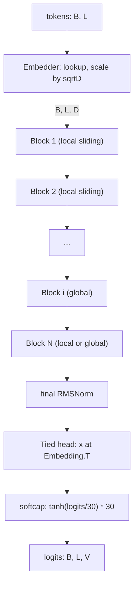
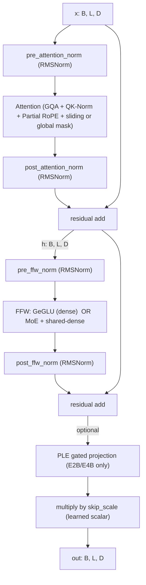

# Gemma 4 — Deep Technical Walkthrough

Gemma 4 (April 2, 2026) is Google DeepMind's fourth-generation family of
open-weight decoder-only transformers, built from the same research as
Gemini 3. This document explains every component of the architecture with
shapes, equations, and pointers to the reference JAX implementation in
this repository.

The companion file `gemma4_minimal.py` is a faithful (text-only)
single-file PyTorch port of the core model that you can read top-to-bottom
and run on a CPU.

## Table of contents

1. [Model family at a glance](#1-model-family-at-a-glance)
2. [Notation and shapes](#2-notation-and-shapes)
3. [End-to-end block diagram](#3-end-to-end-block-diagram)
4. [Embedder (input + tied output head)](#4-embedder)
5. [RMSNorm](#5-rmsnorm)
6. [Interleaved local sliding / global attention](#6-interleaved-localglobal-attention)
7. [Grouped-Query Attention (GQA)](#7-grouped-query-attention-gqa)
8. [QK-Norm](#8-qk-norm)
9. [Partial RoPE (Dual-RoPE)](#9-partial-rope-dual-rope)
10. [Sliding-window mask](#10-sliding-window-mask)
11. [Global-attention specials (K=V, larger key)](#11-global-attention-specials)
12. [Transformer block (pre/post norms + skip_scale)](#12-transformer-block)
13. [GeGLU feed-forward](#13-geglu-feed-forward)
14. [Mixture-of-Experts (26B A4B)](#14-mixture-of-experts-26b-a4b)
15. [Per-Layer Embeddings (E2B / E4B)](#15-per-layer-embeddings-ple)
16. [KV-cache sharing (E2B / E4B)](#16-kv-cache-sharing)
17. [Final logit softcap](#17-final-logit-softcap)
18. [Tokenizer](#18-tokenizer)
19. [Multimodal (brief)](#19-multimodal-brief)
20. [How to implement it yourself](#20-how-to-implement-it-yourself)

---

## 1. Model family at a glance

All sizes share the same DNA. Differences are in width, depth, GQA ratio,
sliding-window size, and whether MoE / PLE / KV-sharing are on.

Reference: `gemma/gm/nn/gemma4/_gemma4.py`.

| Model | Layers | `embed_dim` | Heads | KV heads (local / global) | Sliding | Special |
|---|---|---|---|---|---|---|
| **E2B**       | 35 | 1536 | 8  | 1 / 1   | 512  | PLE on, KV-sharing ~57% of layers, pattern 4L:1G |
| **E4B**       | 42 | 2560 | 8  | 2 / 2   | 512  | PLE on, KV-sharing ~43%, pattern 5L:1G |
| **31B Dense** | 60 | 5376 | 32 | 16 / 4  | 1024 | `k_eq_v_global=True`, pattern 5L:1G |
| **26B A4B MoE** | 30 | 2816 | 16 | 8 / 2   | 1024 | MoE 128 experts × top-8 + shared dense, pattern 5L:1G |

Common to all:
- Vocabulary `V = 262,144`
- Head dim `H = 256`
- FFW hidden = `4 × embed_dim` (for dense layers)
- RoPE base: `10_000` (local), `1_000_000` (global)
- `global_rope_proportion = 0.25`, `local_rope_proportion = 1.0`
- `final_logit_softcap = 30.0`
- `qk_norm_with_scale = True`
- `use_post_attn_norm = True`, `use_post_ffw_norm = True`

---

## 2. Notation and shapes

- `B` = batch size
- `L` = sequence length
- `D` = `embed_dim` (model width)
- `N` = `num_heads`
- `K` = `num_kv_heads` (either local or global)
- `H` = `head_dim` (= `key_size` on local layers; `= global_key_size` on global layers)
- `V` = vocab size
- `P` = `per_layer_input_dim` (PLE, 256 for E-models, 0 otherwise)
- `E` = number of experts (MoE), `k` = top-k routed experts
- `hidden` = FFW hidden dim

Residual stream carries shape `[B, L, D]` through every block.

---

## 3. End-to-end block diagram



One block:



---

## 4. Embedder

Reference: `Embedder` in `gemma/gm/nn/gemma4/_modules.py`.

A single `input_embedding` matrix `E ∈ ℝ^{V × D}` is used for both the
input lookup and the output projection (**weight tying**).

Input:

$$
\text{embed}(x) = E[x] \cdot \sqrt{D}
$$

The `sqrt(D)` scaling is applied to input embeddings (as in the original
Transformer), not to the output projection.

Output (logits):

$$
\text{logits} = h \cdot E^{\top}
$$

where `h ∈ ℝ^{B × L × D}` is the final hidden state.

For multimodal models there are additional projection heads
(`mm_input_projection`, `audio_input_projection`) that project encoder
outputs into the text embedding space. We skip those in the text-only
port.

---

## 5. RMSNorm

Reference: `RMSNorm` in `gemma/gm/nn/gemma4/_layers.py`.

$$
\text{RMSNorm}(x) = \frac{x}{\sqrt{\text{mean}(x^2) + \epsilon}} \cdot g
$$

with `ε = 1e-6` and learned scale `g ∈ ℝ^{D}`. When `with_scale=False`,
`g ≡ 1` (used inside Attention for `value_norm` and in MoE for
`router_norm`).

Note: in JAX this is computed with `jax.lax.rsqrt` (not
`1/sqrt(·)`) because the two differ slightly in float rounding — the
reference explicitly preserves `rsqrt` semantics. In PyTorch this is fine
to compute as `x * torch.rsqrt(var + eps)`.

---

## 6. Interleaved local/global attention

Reference: `attention_pattern` per model class in
`gemma/gm/nn/gemma4/_gemma4.py` and `_create_sliding_mask` in `_modules.py`.

A primary bottleneck for long-context LLMs is the KV-cache, which grows
linearly with context length × number of layers. Gemma 4 uses a hybrid
scheme:

- Most layers are **local sliding** — each token only attends to a window
  of `sliding_window_size` (`512` for E-models, `1024` for 26B/31B) past
  tokens.
- Occasional layers are **global** — full causal attention over the
  entire context.

For 26B/31B/E4B the pattern is `5 local → 1 global`, repeated. For E2B
it's `4 local → 1 global`. Only the global layers pay the full quadratic
cost, so the effective KV-cache is dominated by `num_global_layers / total`.

This is the same idea introduced in Gemma 3, refined further in Gemma 4
with partial RoPE on global layers (see §9).

---

## 7. Grouped-Query Attention (GQA)

Reference: `Attention.__call__` in `gemma/gm/nn/gemma4/_modules.py`.

Standard multi-head attention has `N` Q-heads and `N` KV-heads. GQA
reduces the KV cost (and cache size) by using `K < N` KV-heads, with each
KV-head shared across `G = N/K` query-heads.

Shapes:

- `Q`: `[B, L, N, H]`
- `K, V`: `[B, L, K, H]`

The einsum for attention logits is reshaped into groups:

```
Q' = reshape(Q, [B, L, K, G, H])
logits = einsum('BTKGH,BSKH->BTKGS', Q', K)   # shape [B, L, N=K*G, S]
```

Gemma 4 31B takes this further: on **global** layers it drops to
`num_global_kv_heads = 4`, while local layers use `num_kv_heads = 16`.
26B_A4B uses `8 / 2` (local / global). This is deliberate — global layers
are rare but attend over the whole context, so shrinking their KV matters
most.

---

## 8. QK-Norm

Reference: `self.query_norm`, `self.key_norm` in `Attention.setup`.

Before the attention dot-product, `Q` and `K` are passed through
RMSNorm (both with learned scales, `qk_norm_with_scale=True`).

```
Q ← RMSNorm_q(Q)      # applied per-head over H
K ← RMSNorm_k(K)
V ← RMSNorm_v(V)      # but with_scale=False → just unit-variance scaling
```

Gemma 4 replaces Gemma 2's logit soft-capping with QK-norm. QK-norm
stabilizes training at scale because the inner product `Q·K^T` can no
longer blow up — both are bounded in RMS.

Order-of-ops inside `Attention.__call__` is:

```
Q_proj = x @ W_q           (shape B, L, N, H)
Q_proj = query_norm(Q_proj)
Q_proj = apply_rope(Q_proj, positions)   # RoPE AFTER norm
```

and symmetrically for K.

---

## 9. Partial RoPE (Dual-RoPE)

Reference: `apply_rope` in `gemma/gm/math/_positional_embeddings.py`.

Rotary Position Embeddings (RoPE) encode absolute positions by rotating
pairs of features in each head by angles proportional to position. Gemma
4 uses **two** RoPE frequencies and applies them to **fractions** of the
head dimension:

| Attention type | `base_frequency` | `rope_proportion` |
|---|---|---|
| Local sliding | `10_000`    | `1.0` (full head) |
| Global        | `1_000_000` | `0.25` (only 25% of features rotated; rest is "NoPE") |

The implementation splits the head features into `(first_half, second_half)`
and rotates as:

$$
\begin{aligned}
x'_{\text{first}} &= x_{\text{first}} \cos\theta - x_{\text{second}} \sin\theta \\
x'_{\text{second}} &= x_{\text{second}} \cos\theta + x_{\text{first}} \sin\theta
\end{aligned}
$$

with per-dim frequency

$$
\theta_i = \frac{\text{position}}{\text{base}^{(2i/H)}}
$$

for `i ∈ [0, rope_angles)`, and `cos=1, sin=0` (i.e. no rotation) on
indices `[rope_angles, H/2)`.

Why 25% on global layers? Full RoPE degrades quality beyond ~4× the
training context length because the high-frequency components alias.
Keeping only the low-frequency (large-period) rotations lets global
layers generalize to 128K–256K tokens without retraining.

---

## 10. Sliding-window mask

Reference: `_create_sliding_mask` in `_modules.py`.

For local sliding layers, a token at position `p` can only attend to
cache positions `c` such that:

$$
p - w < c < p + w
$$

where `w = sliding_window_size`. Note the **strict** inequality on both
sides (the JAX implementation uses `>` and `<`). The sliding mask is
multiplied (elementwise) with the causal mask, so the effective window
for a causal decoder is `(p - w, p]`.

This is added on top of the global causal/padding mask; it does not
replace it.

---

## 11. Global-attention specials

Reference: `_gemma4_config` + `Block.setup` in `_gemma4.py` / `_modules.py`.

Two additional tricks apply to global layers on the larger models:

- **Larger key size**: `global_key_size = 512` (vs. local `head_dim = 256`).
  Global layers do more work per head but fewer of them exist.
- **`k_eq_v_global = True`** (26B, 31B): K and V are produced by a
  **single** projection. In code, `self.k_einsum` has shape
  `[K, D, H]` (not `[2, K, D, H]`), and `key_proj = value_proj = x @ W_k`.
  Cuts global attention parameters nearly in half.

---

## 12. Transformer block

Reference: `Block` in `gemma/gm/nn/gemma4/_modules.py`.

A block wraps attention and FFW with a **pre-norm + post-norm sandwich**
(Gemma's signature), plus a learned `skip_scale` at the output.

Pseudocode for the dense variant (`enable_moe=False`):

```python
# Attention sandwich
h = x + post_attention_norm(attn(pre_attention_norm(x), positions, mask))
# FFW sandwich
out = h + post_ffw_norm(mlp(pre_ffw_norm(h)))
# Optional PLE gating (E-models only)
if per_layer_input_dim:
    gate = gelu(per_layer_input_gate(out)) * per_layer_input  # [B,L,P]
    out = out + post_per_layer_input_norm(per_layer_projection(gate))
# Skip scale
out = out * skip_scale
```

`skip_scale` is a learned scalar (shape `[1]`) initialized to `1.0`. The
pre-norm + post-norm sandwich is important: pre-norm stabilizes the
inputs, post-norm stabilizes the residual branch.

---

## 13. GeGLU feed-forward

Reference: `FeedForward` in `_modules.py`.

Dense layers use GeGLU:

$$
\text{FFW}(x) = \big(\text{GELU}(x W_{\text{gate}}) \odot (x W_{\text{up}})\big) W_{\text{down}}
$$

In the JAX code the two up-projections `W_gate` and `W_up` share a single
parameter `gating_einsum` of shape `[2, hidden, D]` and are split along
axis 0:

```python
gate = einsum('BLD, 2HD -> BL2H', x, gating_einsum)   # split into [BLH], [BLH]
activations = gelu(gate[..., 0, :]) * gate[..., 1, :]
out = einsum('BLH, HD -> BLD', activations, W_down)   # "linear" weight
```

`hidden = 4 * D` on dense models. On MoE models the "dense shared" branch
uses `hidden = 2112` and each expert uses `expert_dim = 704` — smaller to
keep per-token FLOPs low.

---

## 14. Mixture-of-Experts (26B A4B)

Reference: `MoERagged` in `gemma/gm/nn/gemma4/_moe.py` and `_forward_moe`
in `_modules.py`.

The MoE block replaces the dense FFW with **two parallel branches summed
before the post-FFW norm**:

1. **MoE branch** — 128 tiny GeGLU experts, each with hidden dim 704.
   Each token is routed to its top-8 experts.
2. **Dense shared branch** — one full-sized GeGLU with hidden 2112, runs
   on every token.

Combined:

```
moe_out   = post_ffw1_norm( MoE(pre_ffw_norm(h)) )
dense_out = post_ffw2_norm( GeGLU(pre_ffw2_norm(h)) )
ffw_out   = post_ffw_norm( moe_out + dense_out )
```

Numbers: only `(8 × 704) / (128 × 704) = 6.25%` of expert FLOPs fire per
token, so the MoE branch activates ≈ 3.8B params/token while holding 26B
total. The dense shared branch always fires, which guarantees
every token gets *some* non-routed capacity.

### Routing algorithm

```python
# router_input: [B, L, D]
r = router_norm(router_input)                  # RMSNorm, no scale
r = r * rsqrt(D) * router_scale                # per-dim scale
logits = r @ router_W                          # [B, L, E]
probs  = softmax(logits, dim=-1)               # in float32
topk_idx = approx_top_k(logits, k=8)           # [B, L, k]
topk_w   = probs.gather(-1, topk_idx)          # [B, L, k]
topk_w  /= topk_w.sum(-1, keepdim=True)        # renormalize
```

`approx_max_k` in JAX is a TPU-fused approximate top-k; a standard
`torch.topk` is correct (just slightly slower).

### Expert dispatch (two ways)

- **`MoE`** (reference slow path) — sorts tokens by chosen expert, runs a
  single dense batched einsum, then un-sorts with a mask.
- **`MoERagged`** (fast path used by checkpoint) — uses
  `jax.lax.ragged_dot` to evaluate each expert on its assigned token slice.

For the PyTorch port I use a simple Python `for` loop over experts. It is
O(E) but readable and easy to reason about. On a real deployment you'd
want grouped GEMMs or `torch.scatter_add`-based dispatch.

### Per-expert output scaling

After each expert computes its output, there's a learned **per-expert
scale** (`per_expert_scale`, shape `[E]`) multiplied elementwise into
that expert's outputs. This is a small but important detail — it lets
the model calibrate the contribution of each expert independently of
routing weights.

---

## 15. Per-Layer Embeddings (PLE)

Reference: `Embedder.encode_per_layer_input` and `Block.__call__` step 3
in `_modules.py`.

PLE is Gemma 4's trick for "effective parameter" models (E2B, E4B). It
adds a **second, per-layer, per-token embedding table**:

$$
E_{\text{ple}} \in \mathbb{R}^{V \times L \times P}
$$

where `P = 256` and `L` is the number of layers. Every token gets an
extra `P`-dim vector at every layer, but these are cheap lookups — they
don't need to participate in attention, only get added to the residual
stream.

Inside a block:

```python
g = per_layer_input_gate(out)          # [B, L, P]   (linear D → P)
g = gelu(g) * per_layer_input[:, :, i, :]  # element-wise with PLE for this layer
add = per_layer_projection(g)          # [B, L, D]   (linear P → D)
add = post_per_layer_input_norm(add)
out = out + add
```

Why "effective 2B"? E2B has **2.3B "active" parameters** that flow
through attention + FFW + non-PLE paths, but **~5B total parameters** on
disk once you include the PLE tables. PLE tables stay in memory but
only contribute a single embedding-lookup + tiny projection per token
per layer. The model loads like a 5B but has the runtime cost of a 2B.

---

## 16. KV-cache sharing

Reference: `create_kv_cache_sharing_patterns`, `KVCacheSharingConfig` in
`_config.py`.

On E-models, a fraction of layers (`frac_shared_layers`) skip computing
their own KV and instead reuse the cache from an earlier layer — the
most recent non-shared global layer's KV for shared global layers, and
the most recent non-shared local layer's KV for shared local layers.

Effect: halves the KV-cache for those shared layers on long contexts.

When a layer's FFW is wider to "compensate" for the shared KV
(`override_kv_shared_ffw_hidden`), the FFW hidden dim is doubled
(`2 × 4 × D`). This is used in E2B only.

Out-of-scope for the minimal port — it's a deployment optimization, not
a modeling novelty.

---

## 17. Final logit softcap

Reference: `Transformer.__call__` (end).

After the tied-head produces `logits ∈ ℝ^{B × L × V}`:

$$
\text{logits} \leftarrow \tanh(\text{logits} / 30) \cdot 30
$$

This bounds `|logits| < 30`. Combined with QK-norm inside attention, it
keeps the model's outputs numerically tame even with bfloat16.

---

## 18. Tokenizer

SentencePiece (byte-level BPE), vocab size **262,144**, same as Gemini 2.
Includes multilingual text + code + digits + image placeholder tokens
(`<|image|>` with id `262144 - 1` range) and audio placeholder tokens.

For the minimal port we use raw int IDs and skip the tokenizer entirely.
To run a real prompt you'd need `sentencepiece` and the `.model` file
shipped with the released weights.

---

## 19. Multimodal (brief)

Even though we skip it in the port, here's the high level so you know
what's there:

- **Vision encoder** (`gemma/gm/nn/gemma4/vision/`): a ViT that
  patchifies variable-resolution images, encodes them, and outputs a
  fixed-length sequence of "soft tokens" (280 per image by default).
  These are projected via `mm_input_projection` into the text embedding
  space and spliced into the token sequence wherever the image
  placeholder appears. On 26B/31B, sliding-window layers use
  **bidirectional attention within an image block** (controlled by
  `use_bidirectional_attention='vision'`).
- **Audio encoder** (`gemma/gm/nn/gemma4/audio/`): a Conformer-based
  audio tokenizer. Takes raw waveforms → mel filterbank →
  subsampling → N Conformer layers → projection. Audio soft tokens are
  spliced in the same way as image tokens.

---

## 20. How to implement it yourself

The companion file `gemma4_minimal.py` implements the **text-only** core
in ~500 lines of PyTorch. It's structured to match the reference code
as closely as possible:

| Reference JAX | Minimal PyTorch |
|---|---|
| `_layers.RMSNorm` | `RMSNorm` |
| `_positional_embeddings.apply_rope` | `apply_rope` |
| `_modules.Embedder` (text path) | `Embedder` |
| `_modules.FeedForward` | `GeGLU` |
| `_modules.Attention` | `GemmaAttention` |
| `_moe.MoERagged` | `TopKRouter` + `MoEFeedForward` |
| `_modules.Block` | `TransformerBlock` |
| `_transformer.Transformer` | `Gemma4` |

Two factory configs are provided:
- `Gemma4Config.e4b_like(...)` — dense E4B shape, scaled down for CPU.
- `Gemma4Config.moe_26b_like(...)` — MoE 26B shape, scaled down for CPU.

See the module docstring and `test_gemma4_minimal.py` for usage.

### Minimal execution recipe

```python
import torch
from gemma4_minimal import Gemma4, Gemma4Config, generate

cfg = Gemma4Config.e4b_like(
    vocab_size=1024, embed_dim=128, num_layers=6,
    num_heads=4, num_kv_heads=2, head_dim=32,
    sliding_window_size=16,
)
model = Gemma4(cfg).eval()
prompt = torch.tensor([[1, 2, 3, 4, 5]])
out = generate(model, prompt, max_new_tokens=8)
print(out)
```

### What to skip on a first pass

If you're learning, ignore PLE and KV-cache sharing on your first
implementation — they are runtime-efficiency tricks, not architectural
novelties. Focus on getting right:

1. **GeGLU** with the two-up-projections-one-param shape.
2. **QK-Norm + partial RoPE** (rotate only a slice of the head dim).
3. **Sliding-vs-global attention** alternation.
4. **GQA** via reshape into groups.
5. **Final logit softcap**.

With those, you have the ~90% of what makes a Gemma 4 checkpoint tick.
The rest (MoE dispatch, multimodal, PLE, KV-sharing) are modular
additions on top.
